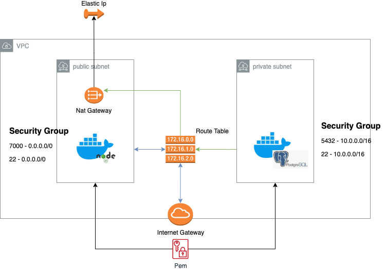

# Code Challenge

<p align="center">
    
</p>

---




## Programa

Para el reto de técnico, se propuso presentar un red con 2 sub-redes; una privada y una pública.


Pública: Despliegue del servidor web 


Privada : Despliegue del servidor de Base de datos


Puntos a mejorar 
* Servidor web en la zona privada 
* Levantar un ngnix quien recepcione las solicitudes y redireccione al servidor web de la zona privada
* Usar Variables para datos sensibles

---


## Requerimientos
Requirements  [terraform CLI](https://www.terraform.io/docs/cli/commands/index.html)

Requirements  [aws CLI](https://aws.amazon.com/es/cli/)


## Usage

```bash
- terraform init
- terraform plan
- terraform apply
```
---

## Estructura

### Estructura principal

    .
    ├── images                    # Documentation files (alternatively `doc`)
    ├── modules                   # módulos de despliegue (network, key , instance)
    ├── script                    # scripts para el despliegue de DB
    ├── main.tf                   # file de declaración de módulos
    ├── provider.tf               # file de declaración de entorno aws
    └── README.md

### Estructuras secundarias 

> **Instance:**  Creación de los 2 servidores

    .
    ├── ...
    ├── instance                   
    │   ├── ec2                    # Creación de los servidores
    │   ├── securityGroup          # Firewall para los servidores 
    │   └── userdata_backend.yaml  # instalación de docker y manejo del despliegue de la aplicación
    │   └── userdata_db.yaml       # instalación de docker y manejo del despliegue de la DB
    │   └── variables.yaml         # variables para uso del módulo instance
    └── ...

> **Key:**  Creación de la llave para el ingreso por ssh

    .
    ├── ...
    ├── key                   
    │   ├── key                    # creación del private key  
    │   ├── output                 # variables de salida
    │   └── variables              # variables para uso del módulo key
    └── ...

> **Vpc:** Creación de la red que soportará los elementos 

    .
    ├── ...
    ├── vpc                   
    │   ├── elasticIp               # Ip de salida del nat
    │   ├── internetGateway         # Interacción con el internet de ls publicsubnet
    │   └── natGateway              # Creación de la Nat
    │   └── output                  # variables de salida
    │   └── routeTable              # Manejo de tabla donde se maneja las rutas de la PublicSubnet y PrivateSubnet
    │   └── subnet                  # Creación de la PublicSubnet y PrivateSubnet
    │   └── variable                # variables para uso del módulo Vpc
    │   └── vpc                     # Creación de la red privada
    └── ...